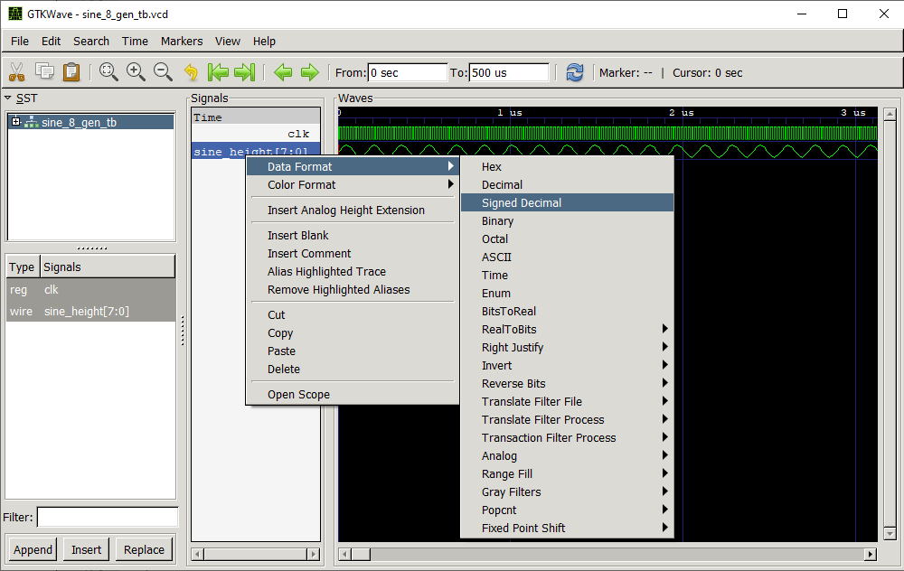

# Simple Verilog Function Generator
 Simple Verilog Function Generator for Audio Synthesizer

## Running Python Script

`
    python3 run.py <module_name>
`

## Sine Wave Generator (sine_gen.v)

```
Remeber SOH CAH TOA?

> sinθ = opposite/hypothenuse

we don't need to know the other ones right now
```

**Key understanding -> a sine wave can be described as the height of a point as it travels along a circle's circumference where the independant variable is usually expressed in radians and the dependant variable describes the height at its current position**


[Source](https://commons.wikimedia.org/wiki/File:Sinus-visualisation.gif)

### How does this translate into Verilog?

The relationship the sine wave describes can be further simplified using a pizza visualization:

> A circle can be sliced into infinitely many "pizza" slices. Each "crust" at the edge of a slice represents the distance it takes to go from one slice to another.

This is an important visualization to generating a sine wave in Verilog as it can be boiled down to this:

> Divide your pizza in $n$ slices. Initially, we start with 0 slices, representing a height of 0. As we move forward in our independant variable (time in our case), we add one more slice (increment). For each slice added, we fetch a precomputed value that determines the new height. As we move forward, each new slice fetches a new value, generating our sine wave. After reaching $n$ slices, we repeat from 0. **To vary the wave, we can add a multiplier to vary the height, or we can modify the time it takes between each step to vary the width.** 

### Generating our precomputed values

We know that the circumference of a unit circle is $2\pi$. Therefore, we select a desired value for $n$, eg. 8 slices. Dividing $2\pi$ by 8 gives us $\pi$/4 slices. We know and understand the relationship of sinθ = opposite/hypothenus. Therefore, starting from zero and incrementing by one slice, we can calculate the height at that point along the circle. Since we are in a unit circle, our hypothenus is 1, this gives us our height in relation to our current distance along the circumference of our circle.

> opposite = sinθ*hypothenus = sinθ

For every step we take in our independant variable, we increase our current position along the circle (θ) and compute our height value.

There is one drawback however to this method so far:
> Our values range from -1 to 1.

Translating this into binary would be a bit too complex for our needs since we would need to follow some type of floating point standard.

A workaround comes by multiplying our computed values by a certain factor we will call $A$ (Amplitude). By amplyfying our computed values, we get to work with larger **integer values** over floating point numbers, while **keeping our accuracy** more or less consistent. We still do lose a bit of accuracy since we cut off everything past the decimal point.

Since our pre-amplified values range between -1 and 1, we need to amplify our values by an amount equal to or less than $2^{k-1}-1$, where k is the number of bits we would like to use for precision while taking into account our signed integers.

This is what a precomputed table of $n = 8$ slices gives us, multiplied by an amplitude factor of 8 bits $A = 2^{8-1}-1 = 127$

| Slices | Distance (θ) | Height| Amp. Height |
|--------|----|--------|----------------------|
|0|0|0|0
|1|$\pi$/4|$\frac{\sqrt{2}}{2}$|90
|2|$\pi$/2|1|127
|3|$\frac{3\pi}{4}$|$\frac{\sqrt{2}}{2}$|90
|4|$\pi$|0|0
|5|$\frac{5\pi}{4}$|$-\frac{\sqrt{2}}{2}$|-90
|6|$\frac{3\pi}{2}$|$-1$|-127
|7|$\frac{7\pi}{4}$|$-\frac{\sqrt{2}}{2}$|-90
|8|$2\pi$|0|0

To pull the corresponding value from this computed table, all we need to know is our current slice value (otherwise refered to as the *index*).

### What it looks like in Verilog

```verilog
module sine_8_gen(
        input clk,
        output reg [7:0] sine_height;
    );

    reg [3:0] slices = 4'd8; \\ Number of slices
    reg [7:0] slice_counter = 0; \\ Counter to keep track of current slices
    reg [7:0] computed_values [7:0]; \\ Computed sine height values

    // Initialize computed values
    initial begin
        computed_values[0] = 8'h00;
        computed_values[1] = 8'h5A;
        computed_values[2] = 8'h7F;
        computed_values[3] = 8'h5A;
        computed_values[4] = 8'h00;
        computed_values[5] = 8'hA6;
        computed_values[6] = 8'h81;
        computed_values[7] = 8'hA6;
    end

    always @(posedge clk) begin
        // n -1 is used due to how always block works
        // when 6 is reached, it will increment to 7
        // however on the next clock cycle, it will go to else setting it to 0
        // BUT at this point, the last statement uses the old value of slice_counter
        // which is 7 at the time it is run
        if (slice_counter < n-1) 
            slice_counter <= slice_counter + 1;
        else
            slice_counter <= 0;

        sine_height <= computed_values[slice_counter];
    end

endmodule
```

**note that in GTKWave it currently displays sine_height as unsigned binary when it should in fact be signed binary. The current fix is to manually edit data format to **signed decimal**.*


